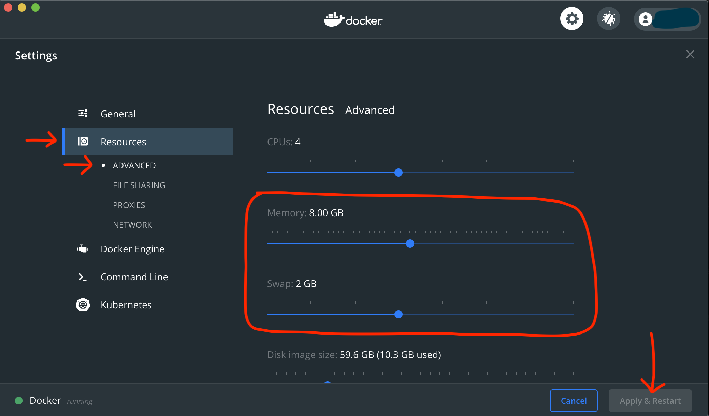

Business Data Science
================
Paul Goodall
12/03/2020

This is the Repo associated with the `Business Problem Solving using Data` workshop.

------------------------------------------------------------------------

These are fairly large downloads (1 GB and 3 GB respectively) - best to do it in the office, and allow plenty of time before tomorrow's session.

------------------------------------------------------------------------

### 1) Need to install and set-up Docker Desktop:

#### 1.1) Windows: (917.MB)

<https://hub.docker.com/editions/community/docker-ce-desktop-windows/>

#### 1.1) Mac: (708.MB)

<https://hub.docker.com/editions/community/docker-ce-desktop-mac/>


#### 1.2) Increase memory available to Docker
Once installed, you need to give Docker the ability to access enough memory to work with our large dataset and run our apps.

1. Open Docker Desktop
1. Go to "Preferences" or "Settings" or similar
1. Go to "Resources" > "Advanced"
1. Use the slider to increase Memory to 8 GB and Swap to 2 GB
1. Apply and restart Docker



------------------------------------------------------------------------

### 2) Need to Pull the docker image to your machine:

#### 2.1) Windows:

-   Open PowerShell

-   type: `docker pull hercules123/goodsy_nyc_taxis`

#### 2.2) Mac:

-   Open a terminal

-   type: `docker pull hercules123/goodsy_nyc_taxis`

------------------------------------------------------------------------

------------------------------------------------------------------------

### Mac Startup (Terminal)

You can use the Mac app `mac_run_session.app`, or you can copy-paste the following commands into Terminal:

``` bash
mkdir -p ~/docker_wormhole;
docker run -d -p 8787:8787 -p 3838:3838 -m=4g -v ~/docker_wormhole:/home/rstudio/docker_wormhole -e DISABLE_AUTH=true hercules123/goodsy_nyc_taxis;
sleep 1;
open http://localhost:8787;
```

### Windows Startup (PowerShell)

You will need to copy-paste the following commands into PowerShell:

``` powershell
mkdir ~/docker_wormhole
docker run -d -p 8787:8787 -p 3838:3838 -m=4g -v ~/docker_wormhole:/home/rstudio/docker_wormhole -e DISABLE_AUTH=true hercules123/goodsy_nyc_taxis
timeout 1
Start-Process http://localhost:8787
```

------------------------------------------------------------------------

### Inside your Docker container:

One you've spun-up your docker container and opened your browser at `localhost:8787`, you're no longer in Mac or Windows, you're in Linux (one of the `Debian` flavours). If this is your first time using Linux, congrats! :)

Your docker container will load into the R-studio IDE.

#### Download the data, etc

Run commands in Terminal tab:

``` bash
cd ~;
. first_time_setup;
```

#### Useful links

-   This Rstudio Server IDE: <a href="http://localhost:8787" target="_blank">Rstudio Server</a>

-   The notebook for the session: <a href="http://localhost:3838/nyc_taxi_notebook/" target="_blank">NYC Taxis Workbook</a>

-   Some examples of shiny apps that you can edit and play with: <a href="http://localhost:3838/examples/" target="_blank">Shiny Examples</a>

------------------------------------------------------------------------

If all else fails, you can follow along here: <a href="https://pg-readify.github.io/nyc_taxi_webpage/" target="_blank">Workshop Notebook</a>
